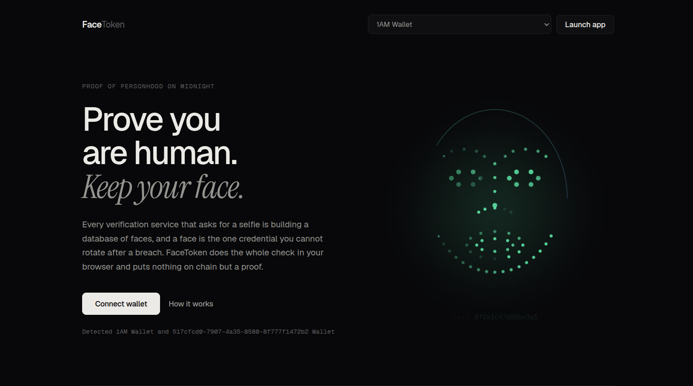
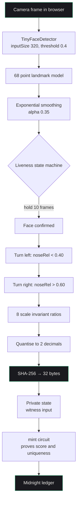

<p align="center">
  
</p>

<h1 align="center">FaceToken</h1>

<p align="center">
  <a href="https://face-tokens.vercel.app/"><strong>face-tokens.vercel.app</strong></a>
</p>

---

## What it does

FaceToken proves you are a real, present human and mints that proof to the
Midnight Network, without your face ever leaving your device. A small detection
model runs in your browser tab, measures your face, and hashes those
measurements before anything is sent anywhere.

**Why that matters**

- **The model runs locally.** Detection happens on your device, not on a server.
- **It is lightweight.** A few hundred kilobytes, so it loads in seconds.
- **It runs on phones.** Any browser with a camera, no app install.
- **Attestation is local.** The hash and the liveness score are computed on device.
- **No image is transmitted.** Not the video, not a frame, not the landmarks.

---

## Why I built this

Logging in with your face is quickly becoming normal. Banking apps, airport
gates, exam software and two factor prompts increasingly ask for a selfie, and
most of them hand that image to a third party vendor to process and store.

The trouble is that a face is a permanent credential. A leaked password takes a
minute to change. A leaked face is yours for life, and once a vendor's database
is breached the image is out for good. Every one of these systems quietly
creates a store of biometric data that has to stay secure forever.

FaceToken takes the position that the verifier does not actually need your face.
It needs to know that a real person completed a liveness check, and that this
particular person has not already registered. Both of those can be proved
without an image ever leaving the device, so that is what it does.

---

## How the recognition works



Everything from the camera down to the hash happens inside the tab. Only the
proof and the 32 byte hash cross the boundary into the circuit.

### What it measures

The landmark model returns 68 points covering the jaw, brows, eyes, nose and
lips. Eight distances are taken from those points:

| # | Measurement | Landmarks |
|---|---|---|
| 1 | Jaw width | 0 to 16 |
| 2 | Nose bridge length | 27 to 30 |
| 3 | Left eye to brow | eye centre to 19 |
| 4 | Right eye to brow | eye centre to 24 |
| 5 | Mouth width | 48 to 54 |
| 6 | Nose tip to upper lip | 30 to 51 |
| 7 | Left eye to mouth corner | eye centre to 48 |
| 8 | Right eye to mouth corner | eye centre to 54 |

### Liveness

A still photograph cannot turn its head. The scanner tracks the nose against the
jaw line across frames and requires the ratio to cross a threshold in both
directions before it will produce a hash.

---

## The mathematics

**Normalisation.** Raw pixel distances are useless on their own, because they
change when you move closer to the camera. Every measurement is divided by the
interpupillary distance:

```
        p_left  = midpoint(L36, L39)
        p_right = midpoint(L42, L45)
        d       = ‖p_right − p_left‖

        r_i     = ‖a_i − b_i‖ / d          for i = 1..8
```

Dividing by `d` cancels the scale factor, so the same face at 30 cm and at 80 cm
produces the same ratios. The measurements are horizontal and vertical spans
rather than absolute positions, so translation cancels too.

**Quantisation.** Floating point noise means two scans of the same face never
agree exactly. Each ratio is rounded to two decimal places:

```
        q_i = round(r_i × 100) / 100
        v   = q_1 ‖ "," ‖ q_2 ‖ … ‖ q_8
```

**Hashing.** The joined string is hashed once with SHA-256 and truncated to the
`Bytes<32>` the circuit expects:

```
        h = SHA-256(v) ∈ {0,1}^256
```

**Determinism.** SHA-256 is a function, so the same `v` always gives the same
`h`. Quantisation is what makes `v` itself stable across scans, and it is the
part that carries the real cost: two ratios either side of a rounding boundary,
say `1.6449` and `1.6451`, quantise differently and produce completely unrelated
hashes. The scheme is therefore repeatable in good conditions rather than
robust, and this is the honest limitation of the current design. A production
system would use locality sensitive hashing or a fuzzy extractor so that nearby
measurements map to the same output.

**Uniqueness.** Eight ratios at two decimals give roughly 10^16 combinations
before accounting for the fact that real faces cluster, so the practical space
is smaller. Uniqueness is not enforced by the hash space anyway. It is enforced
on chain: the circuit rejects a hash that already exists.

```
        assert score ≥ 70
        assert hash ∉ faceHashes
        faceHashes[hash] = tokenId
```

**Privacy.** SHA-256 is preimage resistant, so `h` cannot be turned back into
`v`, and `v` holds only eight rounded numbers, never an image. The liveness
score is checked against a threshold inside the circuit rather than published as
a measurement.

---

## Where this could go

The interesting part is not the token, it is the pattern. Any service that needs
proof of personhood could check a FaceToken instead of collecting a selfie of
its own, which would remove the need for each of them to run a biometric
database at all.

- A shared, open source verification layer that applications read rather than
  rebuild
- Sybil resistance for voting, airdrops and reputation, where one face means one
  account
- Passwordless sign in backed by a proof rather than a stored template
- Age and personhood checks that reveal a yes or no instead of a document

None of that requires a new trusted party, because the verification already
happens on the user's own device.

---

## Setup

Requires Node 20 or newer and the [1AM wallet](https://1am.xyz) extension set to
**Preprod**.

```bash
git clone https://github.com/khushal1512/face-tokens.git
cd face-tokens
npm install
npm run dev
```

Opens http://localhost:3000. A contract is already configured, so you can
connect and mint straight away.

Two notes for preprod. Fees are paid in DUST, so fund your unshielded address
from the [faucet](https://faucet.preprod.midnight.network), let the wallet sync
fully, then register the NIGHT for DUST generation. If your wallet does not
provide proving, start a local proof server with `npm run proof-server`. The app
checks both on connect and tells you before you scan.

| Script | What it does |
|---|---|
| `npm run dev` | Build packages, sync ZK assets, start Vite |
| `npm run build` | Production build into `ft-ui/dist` |
| `npm run compile` | Recompile the Compact circuit (needs `compact` on PATH) |
| `npm run proof-server` | Local proof server on port 6300 |

### File structure

```
contract/
  facetoken.compact        the circuit: mint and verifyHuman
  managed/                 compiled output, proving keys and ZK IR
  src/witnesses.ts         private state the circuit reads

api/
  src/index.ts             FaceTokenAPI, wraps deploy, join and mint
  src/common-types.ts      provider and ledger types
  src/utils/               hex and address helpers

ft-ui/
  src/App.tsx                          state, routing, mint flow
  src/components/Scanner.tsx           camera, landmarks, liveness, hashing
  src/components/LandingPage.tsx       marketing page
  src/components/FaceScanVisual.tsx    animated mesh on the landing page
  src/contexts/BrowserFaceTokenManager.ts   wallet session and providers
  src/hooks/useFaceToken.ts            read-only ledger view
  src/patched-public-data-provider.ts  indexer workaround for latest state
```

The three are npm workspaces. `ft-ui` depends on `facetoken-api`, which depends
on `facetoken-contract`, and the build order is handled automatically.
